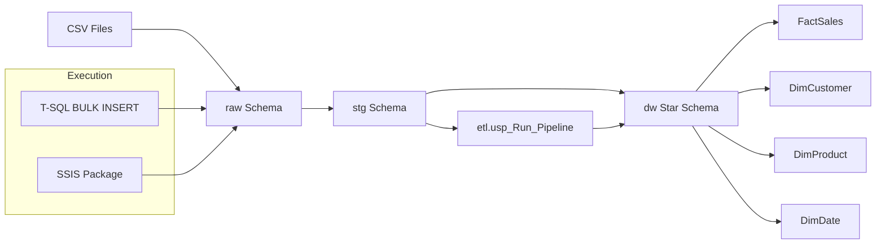

# ETL Pipeline (CSV → Raw → Staging → Warehouse)

This project demonstrates an end-to-end ETL pipeline implemented using SQL Server, with two execution options:

- Option A — T-SQL execution (BULK INSERT)
- Option B — SSIS orchestration

Both options use the same transformation and warehouse logic via the central stored procedure:

    etl.usp_Run_Pipeline

---

## Architecture

CSV files → raw (landing) → stg (typed/cleaned) → dw (star schema)

Execution logging is captured in:

    etl.ETLRunLog

---

## What this project demonstrates

- Raw landing tables (text-first ingestion)
- Typed staging tables with cleansing (TRY_CONVERT, trimming, null handling)
- Dimensional model (star schema):
  - DimCustomer
  - DimProduct
  - DimDate
  - FactSales
- Incremental loads using MERGE
- Central pipeline procedure: etl.usp_Run_Pipeline
- ETL logging with start/success/failure and row counts
- Two execution methods:
  - Database-driven (T-SQL)
  - Integration-driven (SSIS)

---

# How to Run

## Option A — T-SQL Execution (BULK INSERT)

1. Run scripts in order from sql/:

- 01_create_db_and_schemas.sql
- 02_create_raw_tables.sql
- 03_create_staging_tables.sql
- 04_create_dw_tables.sql
- 05_create_etl_logging.sql
- 06_etl_procedures.sql

2. Load CSV files:

    07_bulk_load_raw.sql

3. Execute pipeline:

    EXEC etl.usp_Run_Pipeline;

---

## Option B — SSIS Execution

SSIS handles ingestion and orchestration. SQL Server handles transformations.

### SSIS Flow

1. Truncate raw tables
2. Load Customers CSV → raw.Customers
3. Load Products CSV → raw.Products
4. Load Orders CSV → raw.Orders
5. Execute etl.usp_Run_Pipeline

### Run SSIS

Open:

    ssis/PortfolioETL-SSIS/

Run the package in Visual Studio.

---

## Verification

    SELECT TOP 10 * FROM etl.ETLRunLog ORDER BY ETLRunId DESC;
    SELECT COUNT(*) FROM dw.FactSales;

---

## Why two execution options?

T-SQL shows database-side ETL.
SSIS shows enterprise orchestration.

Both feed the same warehouse pipeline.

---

See screenshots/ for proof of execution.

## Architecture Diagram

## Lessons Learned

- SQLCMD `:r` includes are sensitive to execution context; absolute paths provide the most reliable setup for one-click environments.
- BULK INSERT requires explicit data typing and consistent CSV formats to avoid conversion failures.
- On modern Windows/SQL Server versions, ADO.NET destinations are more stable than legacy OLE DB providers in SSIS.
- Separating raw ingestion from typed staging greatly simplifies error handling and data validation.
- Centralizing transformations in stored procedures enables both T-SQL and SSIS to feed the same warehouse logic.
- Using `MERGE` supports clean incremental loading for dimension and fact tables.
- Step-level ETL logging is critical for operational visibility and debugging.

## Future Improvements

- Add automated data quality checks (row counts, null thresholds).
- Parameterize file paths for environment portability.
- Introduce scheduling (SQL Agent / Azure Data Factory).
- Add Slowly Changing Dimensions (SCD Type 2).
- Expand logging with execution duration metrics.
